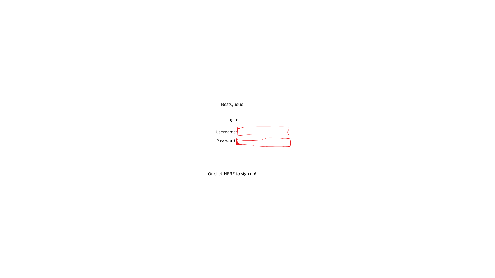

# BeatQueue

## Specification Deliverable

### Elevator Pitch

BeatQueue is a web app designed to solve one of the biggest headaches for performing DJs: managing song requests. It replaces the chaos of people shouting requests or showing you their phones with a simple, live queue. As the DJ, you create a room, share a link, and the crowd can add and upvote songs from Apple Music and SoundCloud. This way, I can keep the flow of the set while also getting real-time feedback on what the crowd wants to hear.

### Design

**1. Login Screen**



A minimal login/registration page. Just the app name, inputs for email/password, and a login button.

**2. Main Event Screen (DJ View)**


This is the main interface. It'll show the event name, a list of requested songs with their upvote counts, and controls for the DJ to manage the queue. The search bar will have a clear toggle to switch between searching Apple Music and SoundCloud.

### Key Features

- Standard, secure login and registration for DJs
- DJs can spin up a new event room with a unique, shareable URL
- The playlist is collaborative and updates for everyone instantly. No page refreshes needed
- Guests can pull tracks from Apple Music for official releases and SoundCloud for all the essential remixes and bootlegs
- A simple upvote feature lets the crowd push the most popular requests to the top
- The DJ has final say and can manage the queue by removing tracks or marking them as played

### Technologies

I am going to use the required technologies in the following ways:

- **HTML:** The structure will be built with semantic HTML5—multiple pages including login/registration, dashboard, live event management, and guest participation interfaces.
- **CSS:** The styling will be a clean, responsive dark-mode UI built with standard CSS. It needs to look good on a laptop in a dark room and on a guest's phone. I'll add some simple transitions for a smoother feel.
- **React:** - Provides login, event dashboard, song queue, song, music search, and use of React for routing and components.
- **Service** - Backend service with endpoints for:
    - register
    - login
    - events
    - eventId
    - search
- **DB/Login** - Stores user data, events (each room's data and song queue). Credentials securely stored in database. Can't access unless authenticated.
- **WebSocket:** - When a user add or upvotes a song, it's broadcast to all other users.

## Deployment instructions

1. Clone this repository to your development environment.
1. Create a `dbConfig.json` file that contains the credentials to access your Mongo Database. This must be placed in the root of the project.

    ```json
    {
        "hostname": "YourMongoDbAccount.xiu1cqz.mongodb.net",
        "userName": "YourMongoDbUsername",
        "password": "YourMongoDbPassword"
    }
    ```

1. Use the deployment script to deploy BeatQueue to an EC2 instance. You will need the PEM key in order to run the script.

    ```sh
    ./scripts/deployFiles.sh -k ~/keys/yourkeyhere.pem -h yourdomainnamehere.click
    ```

1. Verify that the application is running on the domain.

    ```sh
    curl startup.cs260.click
    ```

## HTML deliverable

For this deliverable I built out the structure of my application using HTML.

- [x] **HTML pages** - Four HTML pages: main login/registration page (`index.html`), DJ dashboard (`pages/dashboard.html`), live event management (`pages/event.html`), and guest participation (`pages/join.html`).
- [x] **Links** - Navigation links between all pages work correctly. The main page links to all other sections.
- [x] **Text** - All pages have proper textual content including form labels, event information, song details, and user status information.
- [x] **Images** - Placeholder images are included for DJ profiles, album covers, and design mockups.
- [x] **DB/Login** - Login and registration forms on main page. Dashboard shows event data, song queues, and user statistics that will be pulled from the database.
- [x] **WebSocket** - Live activity feeds, real-time vote counts, and connected user counts represent where WebSocket updates will happen.

## CSS deliverable

For this deliverable I properly styled the application into its final appearance.

- [x] **Header, footer, and main content body** - Dark theme, purple gradient header, structured layout
- [x] **Navigation elements** - Navigation with hover effects and responsive design
- [x] **Responsive to window resizing** - Works on mobile, tablet, and desktop
- [x] **Application elements** - Event cards, queue items, search results, forms, tables all properly styled
- [x] **Application text content** - Consistent typography with purple color scheme and proper hierarchy
- [x] **Application images** - Styled with rounded corners, proper sizing, and album art placeholders

## React Phase 1 deliverable

For this deliverable I converted my application to use React and React routing.

- [x] **Bundled using Vite** - Configured Vite for bundling and development server
- [x] **Multiple React components** - Converted all HTML pages to React components:
    - Login component with registration forms
    - Dashboard component for creating and managing events
    - Event component for live DJ controls and queue management
    - Join component for guest participation
- [x] **React router** - Implemented routing with NavLink and Routes:
    - / routes to Login
    - /dashboard routes to Dashboard
    - /event routes to Event
    - /join routes to Join
    - 404 NotFound component for invalid routes
- [x] **Proper component structure** - Organized components in separate directories with modular architecture

## React Phase 2 deliverable (Interactivity)

For this deliverable I made the application interactive using React state and effects. All features are implemented or mocked end-to-end so the app behaves like the final product.

- [x] **Auth + Routing**
    - App-level auth state with `useState` and `useEffect` persists `userName` in `localStorage`
    - Gated routes for `Dashboard`, `Event`, and `Join` with a simple `RequireAuth`
- [x] **Login**
    - Controlled login/register forms
    - Mock authentication that saves the username and updates app auth state
- [x] **Dashboard**
    - Controlled event creation form
    - Events list persisted to `localStorage` with End/Remove actions
- [x] **Event**
    - Mock search results, add to queue, upvote, remove
    - Now playing with simple progress timer and Mark as Played/Skip
    - Lightweight activity feed interval
    - Queue and now playing persisted to `localStorage`
- [x] **Join**
    - Join form stores guest name
    - Mock search and add to shared queue; vote on items
    - Simulated connected users counter

### How to run locally

```sh
npm install
npm run dev
```

### Deployment

Bundle and deploy the app with the provided service script.

```sh
./deployService.sh -k ~/keys/production.pem -h startup.beatqueue.click -s startup
```

Verify production:

```sh
curl -I https://startup.beatqueue.click/
```

## Service deliverable

For this deliverable I added backend service support with Node.js and Express.

- **Node.js/Express HTTP service** — Backend in `service/index.js`
- **Static middleware** — Express serves the built frontend from `public`
- **Third‑party API** — Music trivia from OpenTDB shown on the Dashboard with a simple “Show answer” button
- **Service endpoints** — Auth (register, login, logout), events list/create, queue add/vote, and `/api/music-trivia`
- **Frontend → service calls** — Login/register/logout, events, and queue actions call the backend
- **Authentication** — Passwords hashed, cookie-based auth, restricted endpoints via middleware

## DB deliverable

For this deliverable I added database support to persist data.

- **MongoDB Atlas** - created database in Atlas
- **Stores data in MongoDB** - stores events and song queues in database
- **Stores credentials** - user info and hashed passwords stored in users collection
- **Authentication** - tokens stored in database, auth middleware checks database
