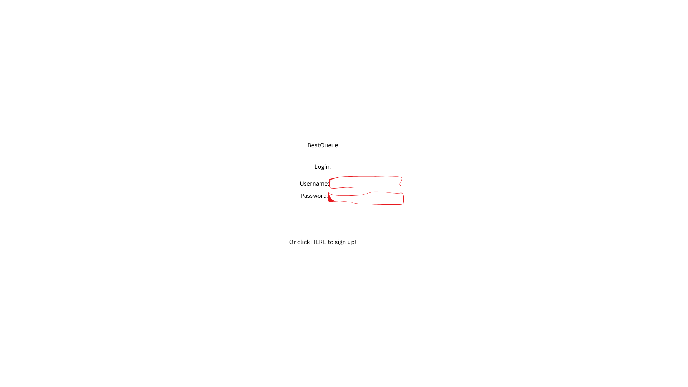
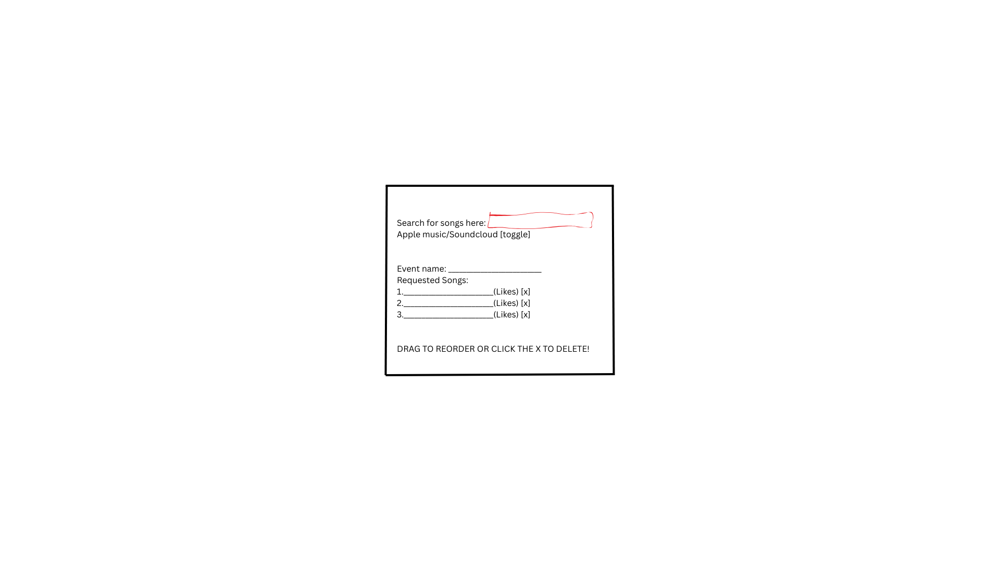

# BeatQueue

## Specification Deliverable

### Elevator Pitch

BeatQueue is a web app designed to solve one of the biggest headaches for performing DJs: managing song requests. It replaces the chaos of people shouting requests or showing you their phones with a simple, live queue. As the DJ, you create a room, share a link, and the crowd can add and upvote songs from Apple Music and SoundCloud. This way, I can keep the flow of the set while also getting real-time feedback on what the crowd wants to hear.

### Design

**1. Login Screen**

A minimal login/registration page. Just the app name, inputs for email/password, and a login button.

**2. Main Event Screen (DJ View)**

This is the main interface. It'll show the event name, a list of requested songs with their upvote counts, and controls for the DJ to manage the queue. The search bar will have a clear toggle to switch between searching Apple Music and SoundCloud.

### Key Features

- **User Auth:** Standard, secure login and registration for DJs.
- **Live Rooms:** DJs can spin up a new event room with a unique, shareable URL.
- **Real-Time Queue:** The playlist is collaborative and updates for everyone instantly. No page refreshes needed.
- **Multi-Source Search:** Guests can pull tracks from Apple Music for official releases and SoundCloud for all the essential remixes and bootlegs.
- **Voting System:** A simple upvote feature lets the crowd push the most popular requests to the top.
- **DJ Control:** The DJ has final say and can manage the queue by removing tracks or marking them as played.

### Technology Specification

Here's the tech stack and how each part will be used:

*   **HTML:** The structure will be built with semantic HTML5—one page for login and another for the main app interface.
*   **CSS:** The styling will be a clean, responsive dark-mode UI built with standard CSS. It needs to look good on a laptop in a dark room and on a guest's phone. I'll add some simple transitions for a smoother feel.
*   **React:** The front end will be a Single Page App (SPA) built with React.
    *   **Components:** I'll break the UI into components like `Login`, `EventDashboard`, `SongQueue`, `Song`, and a `MusicSearch` component that can toggle between the two music sources.
    *   **Routing:** I'll use React Router to handle the views. The `/` route will be for auth, and a protected route like `/event/:eventId` will show the live queue.
*   **Web Service (Backend):** I'll build the backend with Node.js and Express to run the core logic via a REST API.
    *   **Endpoints:**
        *   `/api/auth/register` & `/api/auth/login`
        *   `/api/events` (for creating/managing rooms)
        *   `/api/queue/:eventId` (for managing a room's queue)
        *   `/api/search` (e.g., `?q=term&source=apple`)
    *   **Third-Party APIs:** My service will call the **Apple Music API** and the **SoundCloud API**. This lets users pull in both official tracks and the underground remixes that are essential for a good set.
*   **Database:** I'll use MongoDB to store the data.
    *   **Collections:** A `users` collection for login info (hashed passwords, of course) and an `events` collection to store each room's data and its song queue.
*   **WebSocket:** For the real-time updates, I'll use **Socket.IO**. When someone adds or upvotes a song, the server will emit an event to all clients in that room so the UI updates instantly.

